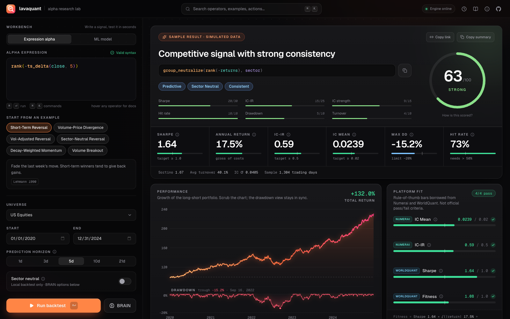

# LavaQuant

Alpha research lab. Write WorldQuant-style expressions, backtest them, compare against BRAIN and Numerai. Next.js + FastAPI + LightGBM.

Unaffiliated with WorldQuant.

Live: [quant.drew.fun](https://quant.drew.fun)



The result on first load is simulated sample data. Run a backtest for real numbers.

## What it does

Type an alpha like `group_neutralize(rank(-returns), sector)`, hit run, get IC, Sharpe, drawdown and a few charts in about 10 seconds.

- Editor with highlighting, autocomplete and live error checking
- Backtests on an S&P 500 sample, sector ETFs, forex and commodities
- Optional submit to WorldQuant BRAIN to compare scores
- LightGBM / ridge models with time-series CV
- Cmd+K palette, and shareable links (`?alpha=...`) that open and run an alpha

## Metrics

Full definitions are in the app under Docs.

| | |
|---|---|
| IC | Daily rank correlation between the alpha and forward returns |
| IC-IR | mean(IC) / std(IC). Daily, not annualized |
| Sharpe | mean / std of daily return, times √252 |
| Turnover | Share of the book traded per day |
| Fitness (est.) | Sharpe × √(\|return\| / max(turnover, 0.125)), WorldQuant's formula on local numbers |
| Score | 0-100 blend of the above. My own heuristic, not an industry metric |

Worth knowing:

- Returns are gross of costs.
- The "platform fit" thresholds are rules of thumb, not official Numerai or WorldQuant criteria.
- Local data is a ticker sample from Yahoo. It won't match BRAIN's numbers, which is why the BRAIN button exists.

## How it's built

Next.js on Vercel calls a FastAPI backend on Railway. The DSL is parsed with `ast` against a function whitelist, no `eval`. BRAIN logins pass through the backend per request and aren't stored or logged.

## Run locally

Python 3.9+ and Node 18+.

```bash
cd backend
python3 -m venv .venv && source .venv/bin/activate
pip install -r requirements.txt
uvicorn app.main:app --reload
```

```bash
cd frontend
npm install
npm run dev
```

Frontend is on :3000, backend on :8000.

## Deploy

Vercel with root `frontend`, Railway with root `backend` (Dockerfile included).

| Variable | Where | |
|---|---|---|
| `NEXT_PUBLIC_API_URL` | Frontend | Backend URL, e.g. `https://x.up.railway.app` |
| `NEXT_PUBLIC_SITE_URL` | Frontend | Public URL, for link previews |
| `ALLOWED_ORIGINS` | Backend | Comma-separated CORS origins. Has defaults |
| `CACHE_DIR` | Backend | Price data cache. Optional |

`NEXT_PUBLIC_*` is baked in at build time, so redeploy after changing it.

## Limitations

- Prices come live from Yahoo and the cache is wiped on deploy, so the first request after one is slow.
- No costs, slippage or borrow fees.
- ML CV only trains on data before each validation fold, with an embargo gap. Not a full purged k-fold.

Research only, not investment advice.
